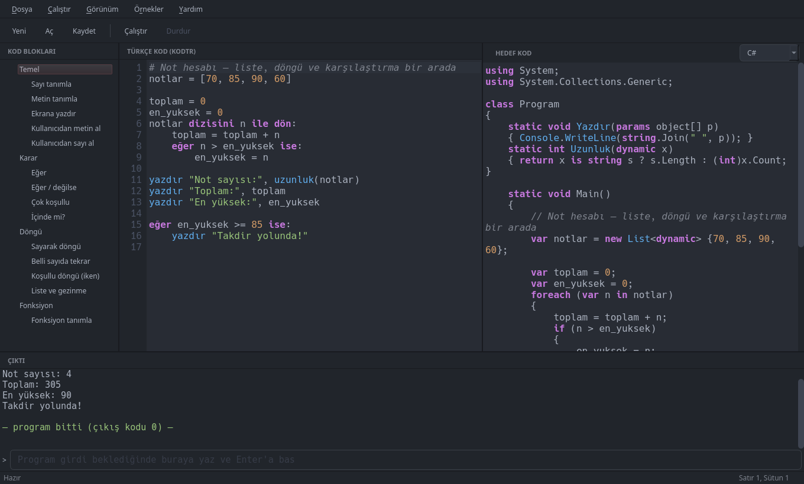
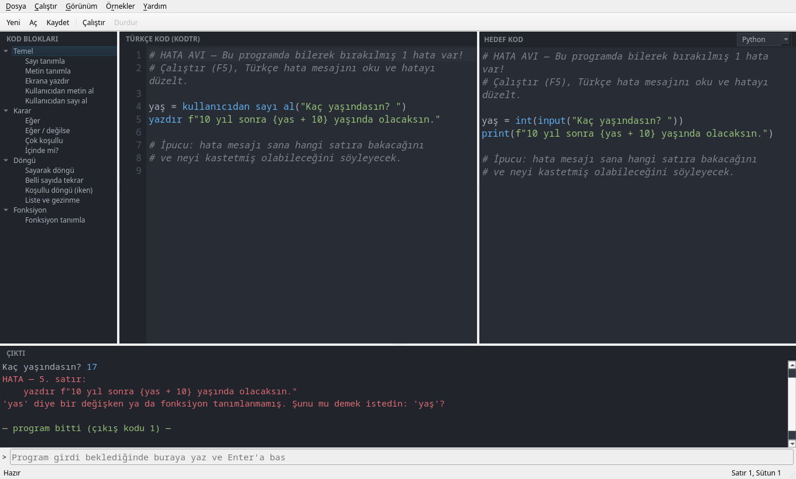
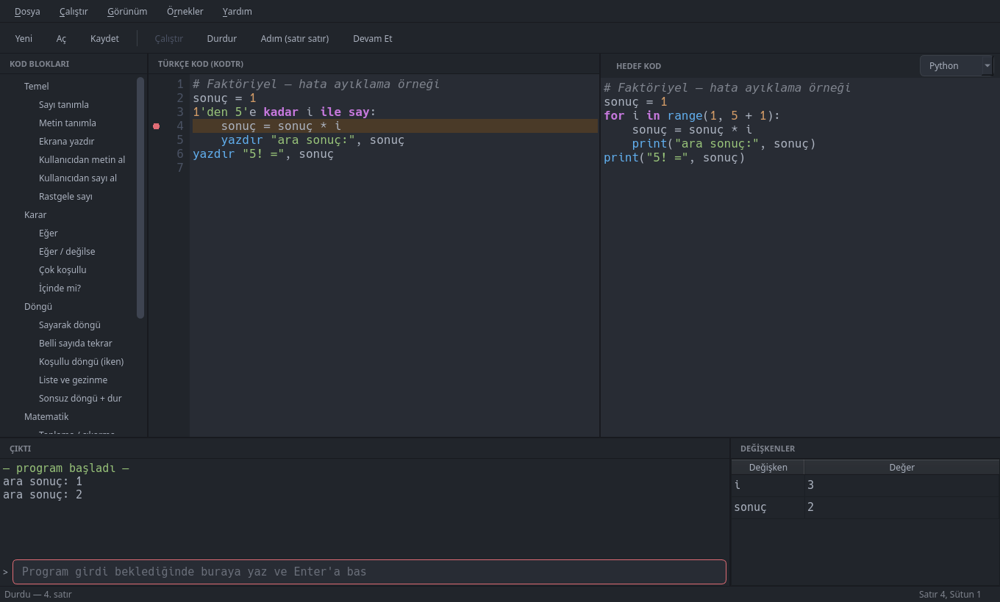

<p align="center">
  
</p>

Türkçe yazılan mini programlama dili — **Python, C# ve JavaScript**
hedeflerine çevrilir. IDE'si ve komut satırı aracıyla birlikte gelir;
Pardus başta olmak üzere Debian tabanlı sistemler için `.deb` paketi
olarak dağıtılır.

```
tanımla sayı1 = kullanıcıdan sayı al("Birinci sayı: ")
tanımla sayı2 = kullanıcıdan sayı al("İkinci sayı: ")
toplam = sayı1 + sayı2
yazdır "Toplam:", toplam
```

## Ekran görüntüleri

Aynı Türkçe kod, seçilen hedefe göre anlık çevrilir — solda blok
menüsü, ortada Türkçe kod, sağda hedef dil, altta program çıktısı:



Hata mesajları Türkçedir, hatalı satırı gösterir ve benzer ad önerir:



Kesme noktası (F2) koyup programı adım adım izleyebilir, her satırda
değişkenlerin güncel değerlerini görebilirsin:



## Kurulum (Pardus / Debian)

```
./paketle.sh
sudo apt install ./dist/kodtr_0.4.0_all.deb
```

Kurulum sonrası:

- **kodtr-ide** — uygulama menüsünden "KodTR IDE" ya da terminalden
- **kodtr** — komut satırı aracı

## Geliştirme ortamında çalıştırma (paketsiz)

```
cd KodTR
python3 -m kodtr_ide                      # IDE
python3 -m kodtr ornekler/toplama.kodtr   # CLI ile çalıştır
python3 -m kodtr çevir ornekler/toplama.kodtr                # Python halini gör
python3 -m kodtr çevir ornekler/toplama.kodtr --hedef cs     # C# halini gör
python3 -m kodtr çevir ornekler/toplama.kodtr --hedef js -o toplama.js
```

Gereksinim: Python 3.9+ ve PyQt6 (`python3-pyqt6`).

## Hedef diller

| Hedef | CLI adı | Uzantı | Çalıştırma |
|---|---|---|---|
| Python | `python`, `py` | `.py` | IDE içinden F5 / `python3` |
| C# | `csharp`, `cs`, `c#` | `.cs` | `mcs dosya.cs && mono dosya.exe` veya `dotnet` |
| JavaScript | `javascript`, `js` | `.js` | `node dosya.js` (girdi stdin'den okunur) |

IDE'de sağ paneldeki **HEDEF KOD** seçicisinden dil seçilir; Türkçe kod
yazıldıkça seçili dile çevirisi anlık görünür. **Dosya → Çeviriyi Dışa
Aktar** (Ctrl+E) her hedefi kendi uzantısıyla ayrı dosyaya yazar —
transkriptler birbirine karışmaz. F5 çalıştırması her zaman Python
üzerinden yapılır.

C# ve JavaScript çıktılarında girdi/yazdırma için Türkçe adlı küçük
yardımcı fonksiyonlar (`SayıAl`, `metinAl` gibi) yalnızca
kullanıldıklarında dosyanın başına eklenir.

## Türkçe hata mesajları

Program hata verdiğinde İngilizce traceback yerine, hatanın olduğu
KodTR satırını gösteren Türkçe bir açıklama alırsın:

```
HATA — 5. satır:
    yazdır f"10 yıl sonra {yas + 10} yaşında olacaksın."
'yas' diye bir değişken ya da fonksiyon tanımlanmamış. Şunu mu demek istedin: 'yaş'?
```

Sık hatalar için özel açıklamalar var: tanımsız değişken (benzer ad
önerisiyle), sıfıra bölme, sayı beklenirken metin girilmesi, liste
sınırı aşımı, eksik `:`, kapatılmamış parantez/tırnak, girinti hatası,
yanlış parametre sayısı ve sonsuz özyineleme. Hem IDE'nin çıktı
panelinde hem komut satırında çalışır.

IDE'deki **Örnekler** menüsünden hazır programlar açılabilir;
`hata_avi.kodtr` bilerek hatalı bırakılmıştır — çalıştır, Türkçe hata
mesajını oku, hatayı düzelt.

## Hata ayıklama (debugger)

Satır numarasının soluna tıklayarak ya da **F2** ile kesme noktası
konur (kırmızı nokta). **F5**'e basınca program o satıra gelince durur;
o an **Değişkenler** panelinde tüm değişkenlerin güncel değeri görünür.
Oradan **F10** ile satır satır ilerler, **F8** ile bir sonraki kesme
noktasına kadar devam edersin. Kesme noktası yoksa F5 programı normal
çalıştırır. Bu, döngü ve değişken kavramlarını tahtada göstermenin en
kolay yoludur.

## Dil rehberi

Çeviri satır satır, birebir yapılır: KodTR'deki 5. satır, üretilen Python
kodunda da 5. satırdır. String ve yorum içlerine asla dokunulmaz.

| KodTR | Python |
|---|---|
| `yazdır x` veya `yazdır(x)` | `print(x)` |
| `kullanıcıdan al("soru")` | `input("soru")` |
| `kullanıcıdan sayı al("soru")` | `int(input("soru"))` |
| `kullanıcıdan ondalık al("soru")` | `float(input("soru"))` |
| `tanımla x = 5` | `x = 5` (tanımla opsiyonel) |
| `eğer x > 5 ise:` | `if x > 5:` |
| `değilse eğer ... ise:` | `elif ...:` |
| `değilse:` | `else:` |
| `x < 10 iken:` | `while x < 10:` |
| `meyveler dizisini meyve ile dön:` | `for meyve in meyveler:` |
| `1'den 10'a kadar i ile say:` | `for i in range(1, 10 + 1):` (bitiş dahil) |
| `10'a kadar say:` | `for _ in range(1, 10 + 1):` |
| `3 kere tekrarla:` | `for _ in range(3):` (`defa`/`kez` de olur) |
| `eğer x meyveler içinde ise:` | `if x in meyveler:` |
| `notlar'a 5 ekle` | `notlar.append(5)` (C#: `.Add`, JS: `.push`) |
| `ekrana yaz "selam"` | `print("selam")` |
| `her i için aralık(10):` | `for i in range(10):` |
| `fonksiyon topla(a, b):` | `def topla(a, b):` |
| `döndür sonuç` | `return sonuç` |
| `dur` / `devam et` / `geç` | `break` / `continue` / `pass` |
| `ve` / `veya` / `değil` | `and` / `or` / `not` |
| `doğru` / `yanlış` / `hiçbiri` | `True` / `False` / `None` |
| `rastgele(1, 10)` | `random.randint(1, 10)` (iki uç dahil) |
| `uzunluk`, `tamsayı`, `ondalık`, `metin`, `mutlak`, `yuvarla`, `enbüyük`, `enküçük`, `sırala` | `len`, `int`, `float`, `str`, `abs`, `round`, `max`, `min`, `sorted` |

Kurallar:

- Değişken adlarında boşluk olmaz: `sayı 1` değil `sayı1`. Türkçe karakter
  serbesttir (`sayaç`, `sonuç` geçerli birer isimdir).
- Türkçe karaktersiz yazım da kabul edilir: `yazdir`, `eger`, `dongu` gibi.
- Girinti Python'daki gibi anlamlıdır (4 boşluk).
- Metinlerde çift tırnak kullan (`"elma"`). Kesme işareti `10'a`, `n'e`
  gibi ekler için ayrılmıştır; aynı satırda tek tırnaklı metinle
  karışabilir.
- Sözlükte olmayan her şey olduğu gibi Python'a geçer — yani Python'un
  tamamı gerektiğinde KodTR içinde kullanılabilir.

## Proje yapısı

```
kodtr/            Dil çekirdeği (bağımsız paket, PyQt gerektirmez)
  sozluk.py       Türkçe kelime tabloları (dili buradan genişlet)
  cevirici.py     Tokenizer + Türkçe cümle kalıpları -> Python
  hedefler/       Hedef dil backend'leri
    python.py     Python (çekirdek çıktının kendisi)
    csharp.py     C# (class Program + Main, Türkçe yardımcılar)
    javascript.py JavaScript (Node.js)
    ara.py        Ortak katman: satır yapıları + ifade çevirici
  __main__.py     CLI: kodtr çalıştır / çevir --hedef ...
kodtr_ide/        PyQt6 IDE
  vurgulayici.py  Söz dizimi renklendirme (KodTR + hedef diller)
  editor.py       Satır numaralı, otomatik girintili editör
  ana_pencere.py  Ana pencere, hedef seçici, F5, dışa aktarma
ornekler/         Örnek .kodtr programları
veri/             .desktop dosyası
paketle.sh        .deb paketi üretir (dist/ altına)
```

Yeni hedef dil eklemek: `kodtr/hedefler/` altına modül yaz,
`HEDEFLER` tablosuna satır ekle — IDE seçicisi ve CLI otomatik tanır.

## Yol haritası

- [ ] Hata mesajlarının Türkçeleştirilmesi (traceback çevirisi)
- [ ] IDE: otomatik tamamlama, kelime ipuçları
- [ ] C# / JS çıktısını IDE içinden çalıştırma (mcs/node varsa)
